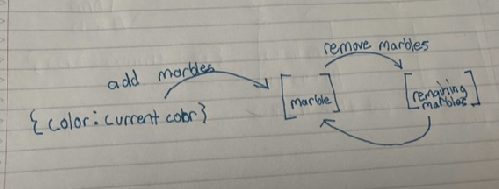
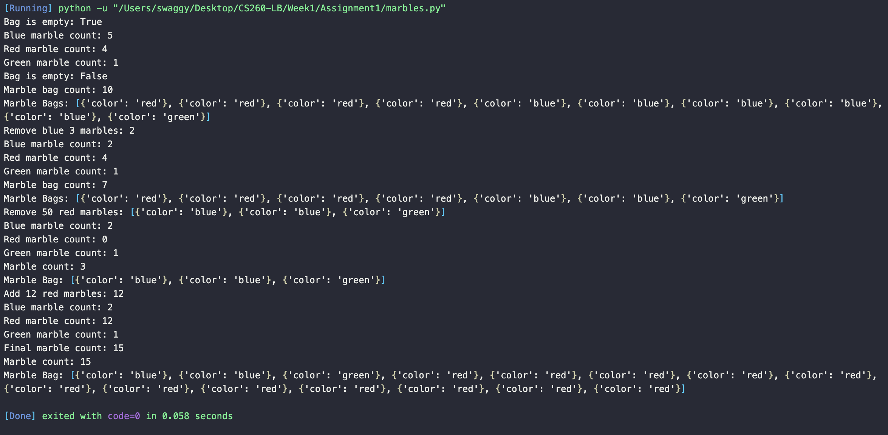

<h1>Implementation Design</h1>

In this assignment, we are creating a program to model a bag of marbles with specific behaviors and properties.

<h2>Design</h2>
<h3>Variables</h3>
<ol>
  <li>
    The marble bag will be stored in an array with each marble being used as a dictionary (essentially being an array of objects).
  </li>
  <li>
    The key:value pair for the marble dictionary will be color:current color. 
  </li>
</ol>
<h3>Adding Marbles</h3>
<ol>
  <li>
    Set up the function to add marbles with the parameters being the color of the marble and the default amount of 1 if there is no specified amount when we add a marble.
  </li>
  <li>
    Iterate and set up a loop to add the amount of marbles for the color.
  </li>
  <li>
    Add the specified marble color after each loop.
  </li>
</ol>
<h3>Removing Marbles</h3>
<ol>
  <li>
    Set up a function to remove marbles with the paramaters being the color of the marble and the default amount of 1 if there is no specified amount when we add a marble.
  </li>
  <li>
    Initialize a new variable for a new marble bag. We will create a new marble bag to track all the marbles that weren't removed.
  </li>
  <li>
    Initialize counter for removed marbles.
  </li>
  <li>
    Iterate over each marble in the old marble bag.
  </li>
  <li>
    Set up a conditional to check if we have the color currently in our bag and go to the default else statement once we reach the amount of marbles removed needed (If its specified that we have more removed than the amount we currently have, it will remove all the marbles).
  </li>
  <li>
    If it meets matches our if statement than we increment the count. Once we reach the amount of marbles removed on our iteration, the else statement will be ran and append all the remaining marbles for the specified color into a new marble bag.
  </li>
  <li>
    After exiting the loop, we will reassign/pass on the data for the updated marble color from the new marble bag into the main marble bag.
  </li>
</ol>
<h3>Empty Marble Bag</h3>
<ol>
  <li>
    Check if there is any values inside our marble bag (array).
  </li>
</ol>
<h3>Check Marble Bag Content</h3>
<ol>
  <li>
    Check if marble bag is empty.
  </li>
  <li>
    If marble bag is not empty, iterate over the marble bag to get each marble and send a print statement to see it in the console.
  </li>
  <li>If the bag is empty then we will print a statement in the console mentioning the bag is empty.</li>
</ol>
<h3>Check Marble Bag Count</h3>
<ol>
  <li>
    Initialize a variable to store the count for each marble.
  </li>
  <li>
    Iterate over the marble bag.
  </li>
  <li>
    Increment count for each marble in the marble bag.
  </li>
  <li>
    Print the count after the loop is over.
  </li>
</ol>
<h3>Check Specific Marble Count in Bag</h3>
<ol>
  <li>
    Check if marble bag is empty.
  </li>
  <li>Initialize marble count for the marble we need in the marble bag.</li>
  <li>If not empty iterate over each marble in marble bag.</li>
  <li>Check if the color we need is currently inside of our marble bag.</li>
  <li>If the color is inside our marble bag, we will increment the marble color count variable.</li>
  <li>Once the loop is complete, print out the marble count if the bag wasn't empty. If the bag is empty, print out a statement that the bag was empty.</li>
</ol>

<h3>Testing</h3>
<ol>
  <li>Check if we can track whenever bag is empty.</li>
  <li>Check total marble count in bag</li>
  <li>Check if we can add marbles (red: 4, blue: 5, green:1)</li>
  <li>Check if we can display all marbles in bag</li>
  <li>Check if we can remove marbles(we'll remove 3 blue marbles in testing)</li>
  <li>Check if we remove more marbles than we currently have that it just removes all the marbles for the specific color (remove 50 marbles)</li>
  <li>Check if red marbles still exists in bag after being removed (should not be in the bag at all)</li>
  <li>Check if we can add red marbles back with no bugs</li>
</ol>

line 55-105: 

