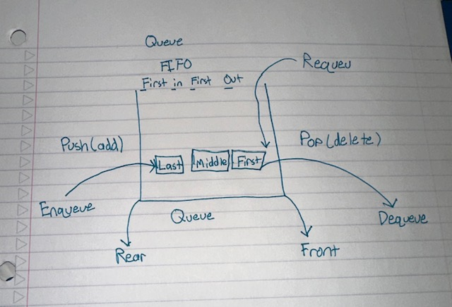
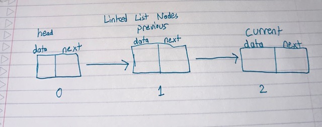
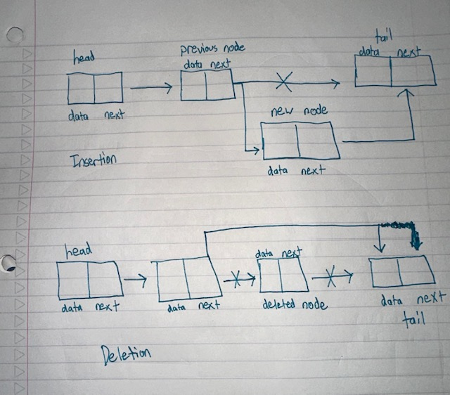

<h1>Based on what we know about linked lists, stacks, and queues, design a queue data structure:</h1>
<h2>What functions are we likely to need for a queue to function like the one discussed in class?</h2>
Functions needed for queue:
<ul>
<li>
Adding to the rear of the Queue (Enqueue): We will need to add (push) our element/data into the end (rear index) of the queue.
</li>
  <li>
    Removing from the top of the Queue (Dequeue): We will need to remove (pop) our element from the top (front index) of the queue. We will need to know where the top is to properly remove the correct element.
  </li>
  <li>
    Adding to front of the Queue (Requeue): We will need this function to add to the top (front index) of the queue. We will need to know where the top is to properly add the element to the top.
  </li>
  <li>
    Checking if queue is empty: Check if queue is empty. Traverse through the queue, if we don’t have a value for the top of the queue, then we have an empty queue.
  </li>
  <li>
    Checking capacity of queue: If the queue is full, we need to make sure to check that the top of our queue is pointing to the top correctly.
  </li>
  <li>Peek at the top of the queue: Function will return the value for the top of the queue. This allows us to be able to consistently track what we have added to the top of the queue.
</li>
</ul>

<h1>What values will we need to know about the structure for our queue to function properly?</h1>
<h2>
  Values needed for queue to function properly:
</h2>

<ul>
  <li>
    New_value: This value is used to add (push) into the rear of the queue.
  </li>
    <li>
    Storage: This is the array that is used to store the internal queue values.
  </li>
    <li>
    Storage_arr: This value is used as a pointer for the queue.
  </li>
    <li>
    Top_index: This value is used to get the top index of the queue and will be used to delete (pop) from queue.
  </li>
</ul>

<h1>Based on what we know about linked lists, design a list data structure that allows us to add (insert) or remove (delete) values at a given location in the list (instead of the top of a stack or the front or back of a queue):</h1>
<h2>What functions are we likely to need for a list to function like this?</h2>
Functions needed for linked list:
<ul>
  <li>
    Insertion to linked list: We will need to insert new nodes at specific positions. Need to check if head is still present. Traverse to the next node until it is equal to the position we need. Insert new node to the position needed and update the adjacent nodes accordingly.
  </li>
  <li>
    Deletion to linked list: We will need to delete nodes at specific positions. Need to check if head is still present. Traverse to the next node until it is equal to the position we need. Remove the node at the specified position and update the adjacent nodes accordingly.
  </li>
  <li>
    Traversing the linked list: We will need to traverse the linked list from the head node to the tail node. We can use this to check the data of each node as we iterate through the linked list.
  </li>
</ul>
<h2>Values needed for linked list to function properly:</h2>
<ul>
  <li>Head: The actual value/data stored inside each node – checks for current val of current node</li>
  <li>Current: The current node for the node that is being accessed or processed along the linked list. We can use this as a temporary head if we decide not to iterate and make changes to the original linked list</li>
  <li>Next: Pointer to the next node in the linked list</li>
  <li>Prev: Pointer to the previous node in the linked list</li>
</ul>

