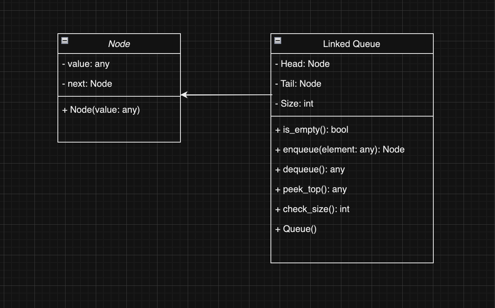
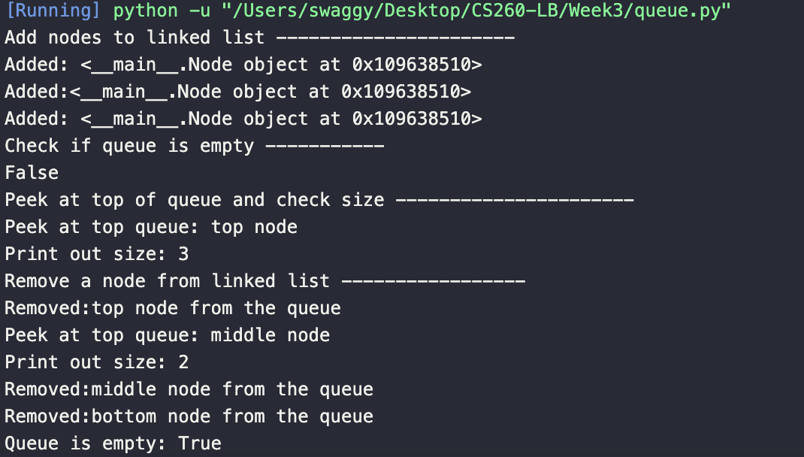
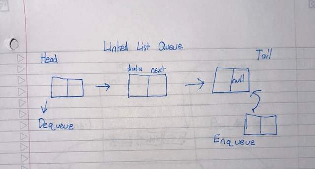

<h1>Based on what we know about linked lists, stacks, and queues, design a linked queue</h1>
<h2>Functions used in Linked Queue Data Structure</h2>
<ol>
<li>enqueue(x) (O1): Insertion. We will take an element as a parameter for the enqueue function and add the value of the element to the back of the queue. We will check the linked list to see if its empty. If the linked list is empty, the node that we add will become both the head and tail. If it is not empty, we will link the tail to a new node and update the tail pointer with the new node. We will increase our size variable for each time we add to the linked list. The head value of the linked list is returned in this function.</li>
<li>dequeue() (O1): Deletion. We will remove the element from the front of the queue and return the value that is removed. We will check if the linked list is empty, if it is empty than we will do nothing. If the linked queue is not empty, we reassign the head of the node to a temporary value and assign the new head pointer to the next node in the queue. The temporary value that was removed will be returned for this function.</li>
<li>peek_top() (O1): We will create a function that will return the value at the front of the queue (without removing it). Check if linked list is empty, if not empty return the head value of the linked list node.</li>
<li>check_size() (O1): Check the size of the queue to keep track of how many nodes are currently present in linked queue. Return size of linked list.</li>
<li>is_empty() (O1): Check whether queue is empty or not. We will check the linked list and validate if the queue is empty. Check if there is a head in the linked queue, if the head node of the linked queue is None, then it is an empty linked queue. Return boolean value for whether or not the linked queue is empty.</li>
</ol>
<h2>Values used in Linked Queue Data Structure</h2>
<ol>
<li>Head: The head of the linked list points to the front of the queue. It keeps track of the first element in the queue.</li>
<li>Tail: The tail of the linked list points to the back of the queue. It keeps track of the last element in the queue.</li>
<li>Size of the queue. It keeps track of the queue size when we add or delete a node.</li>
</ol>

<h2> Implementation Complexities </h2>
<ol>
<li>Enqueue (O1): Enqueue function involves creating a new node and updating the tail pointer. This functions is constant time since it does not depend on the size of the queue.</li>
<li>Dequeue (O1): Dequeue function involves updating the head pointer. This function is constant time since it does not depend on the size of the queue.</li>
<li>PeekTop (O1): Peek top operation returns the value of the head node. It is a constant time operation since it does not depend on the size of the queue unless it is empty.</li>
<li>CheckSize (O1): The size of the queue is maintained as a variable, so checking the size is a constant time operation.</li>
<li>IsEmpty (O1): Check's whether or not there is a node at the head of the linked list, so checking the queue is a constant time operation. </li>
</ol>

<h1>Diagram of Values:</h1>

 

<h1>Testing Implementation:</h1>
Lines 53-84

<h1>Linked Queue Example:</h1>

