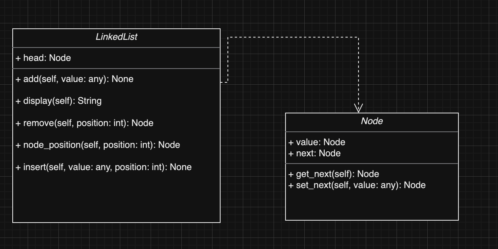
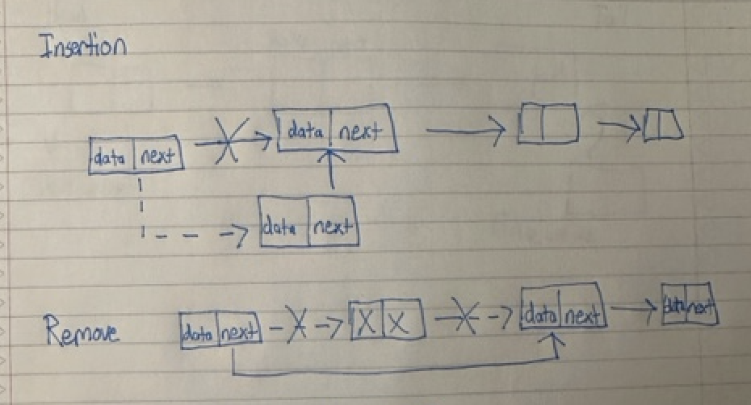

<h1>Design a Linked List</h1>
<h2>Functions used in Linked List Data Structure</h2>
<ol>
<li></li>
<li></li>
<li></li>
<li></li>
<li></li>
</ol>
<h2>Values used in Linked List Structure</h2>
<ol>
<li></li>
<li></li>
<li></li>
</ol>

<h2> Implementation Complexities </h2>
<ol>
<li></li>
<li></li>
<li></li>
<li></li>
</ol>

<h1>Diagram of Values:</h1>

<h1>Linked List Example:</h1>

<h1>Testing Implementation:</h1>
Lines 107-158

