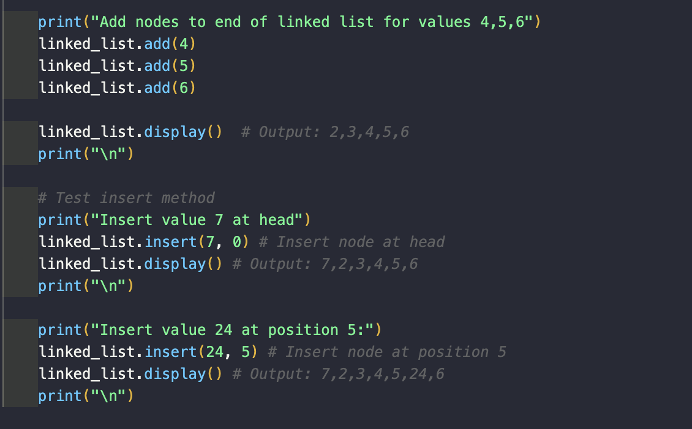

<h1>Design a Linked List</h1>
<h2>Functions used in Linked List Data Structure</h2>
<ol>
<li>Insert (value, position) Insertion O(N): We will take the value and position data in the parameter and insert it into the linked list at the specific position with its value.</li>
<li>Remove (position): Deletion O(N): We will remove the node value of the linked list based on what position it is on for the parameter value.</li>
<li>Add (value): Addition O(N): We will add the value in the parameter to the tail of the linked list.</li>
<li>Node_Position(position) O(N): We will create a function that will return the value of the node at the position based on the value inside the parameter (without removing it).</li>
<li>Display() O(N): Print out the linked list nodes to get a clear idea of what nodes are present in the linked list and what the order is.</li>
</ol>
<h2>Values used in Linked List Structure</h2>
<ol>
<li>Head: The head of the linked list, it keeps track of the first element in the queue.</li>
<li>Value: Represents the data or content stored in a node of the linked list.</li>
<li>Next: Reference to the next node in the linked list.</li>
</ol>

<h2> Implementation Complexities </h2>
<ol>
<li>Insert: This will be O(N) because we traverse through the linked list n times to insert the node within the specific position. Thus our time complexity is dependent on n, the number of nodes on the linked list.</li>
<li>Remove: This will be O(N) because we traverse through the linked list n times to find the node to remove. Thus our time complexity is dependent on n, the number of nodes on the linked list.</li>
<li>Add: This will be O(N) because we traverse through the linked list n times. Thus our time complexity is dependent on n, the number of nodes on the linked list. Although, we could also make the time complexity better and make it O(1) by just inserting it at the tail.</li>
<li>Node Position: This will be O(N) because we traverse through the linked list n times to find the correct node position. Thus our time complexity is dependent on n, the number of nodes on the linked list.</li>
<li>Display: This will be O(N) because we traverse through the linked list n times. Thus our time complexity is dependent on n, the number of nodes on the linked list.</li>
</ol>

<h1>Diagram of Values:</h1>

<h1>Linked List Example:</h1>

<h1>Testing Implementation:</h1>
Lines 107-158

