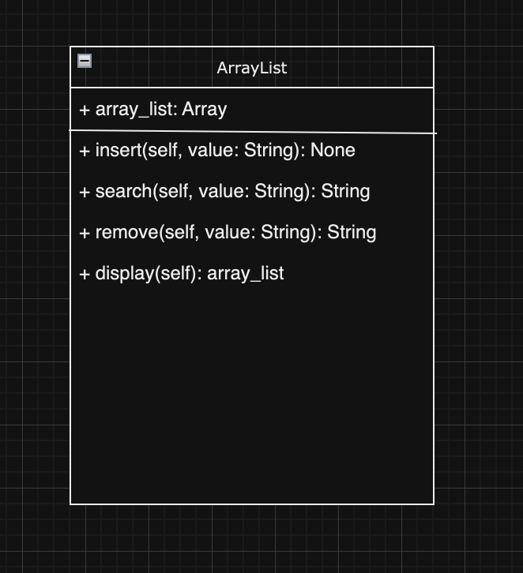

<h1>Testing Implementations</h1>
<h2>File: LinkedListAutoSort.py</h2>
<h2>File: ArrayListAutoSort.py</h2>

<ul>
<h2>Linked List</h2>
<h3>Insertion</h3>
<li>Add a number less than 5 into linked list (Least greatest)</li>
<li>Add a number greater than 2 and 5 into linked list (Greatest)</li>
<li>Add a number greater than 2 but less than 5 into linked list (Middle)</li>
<li>Add a same number thats already in the linked list</li>
<h3>Remove</h3>
<li>Remove value 3 from linked list (middle value)</li>
<li>Remove value 1 from linked list (least greatest value)</li>
<li>Remove a value that wasn't present in linked list</li>
<li>Remove last value that was inside linked list</li>
<h3>Search</h3>
<li></li>
<li></li>
<li></li>
</ul>

<ul>
<h2>Array List</h2>
<h3>Insertion</h3>
<li>Add a number into the linked list (5)</li>
<li>Add a number less than 5 into linked list</li>
<li>Add a number greater than 3 and 5 into the array list (greatest)</li>
<li>Add a number that is in the lower boundary to the array list (least)</li>
<li>Add a number thats already in the linked list</li>
<li>Add a number in the upper boundary into the array list</li>
<h3>Remove</h3>
<li>Remove value 5 from linked list (middle value)</li>
<li>Remove value 1 from linked list (least greatest value)</li>
<li>Remove a value that wasn't present in linked list</li>
<li>Remove last value/greatest that was inside linked list</li>
</ul>

<h1>UML Diagrams</h1>

