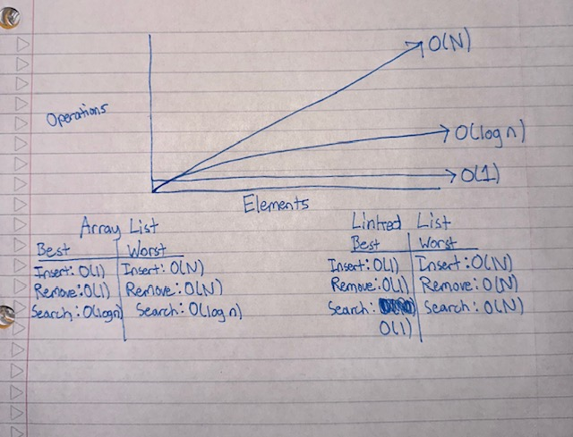

<h1>Design a Linked List</h1>
<h2>Functions used in Linked List Data Structure</h2>
<ol>
<li>Insertion:  Initialize node for linked list (that is in ascending order) with the new value for insertion. Check if value is smaller than the head or if the linked list is empty. If it meets this condition we will set the new value as the new head and reassign the next node as the previous head. If the value is greater than the head, we will traverse the linked list until we get to a value in which the new value is less than the current node we get to on the linked list. Once we reach the position, we will reassign the value to the node and reassign the next nodes in the linked list.</li>
<li>Remove: Initialize head node and check if our head is equal to the value we are trying to remove. If it meets this condition, we will update the head with the next node value. If its not equal to the head, we will traverse the linked list until we get to the value. Once we get to the current linked list node that is equal to the new value, we will update the linked list to remove the node with the value and reassign the later nodes.</li>
<li>
Search: Establish a two-pointer structure, utilizing 'low' and 'high' variables to define the starting and ending positions of the array list, respectively. Employ binary search approach and traverse the array list, initializing a 'mid' variable to assess the midpoint. Check if our desired value lies within the lower or upper boundary, or if we have pinpointed its index. If the value surpasses the midpoint, our search narrows down to the lower boundary. If it is less than the midpoint, we focus on the upper boundary. Continue search until we locate the desired value or see if the value is not inside the array list.</li>
<li>Display: Initialize head and list. Iterate through linked list and append each node to the list. Return the array to display our linkedlist.</li>
</ol>
<h2>Functions used in Array List Data Structure</h2>
<ol>
<li>Insertion: Initialize index to check where our value is while traversing through array list (that is in ascending order). Check if our current index in the array starting from 0 is less than the value we are inserting and keep traversing list until we reach the end, while incrementing the index. Once we meet the conditions we will insert the value into the array with the index it needs to be in and what the value is.</li>
<li>Remove: Traverse the linked list (that is in ascending order) until we reach the value in the array list. Once we meet this condition we will remove the value from the array list and return the value.</li>
<li>Search: We will set up a two pointer data structure and perform a binary search with the low and high variables, representing the start and end of the array list. We will traverse the array list and initialize a mid variable to check either the lower boundary, upper boundary, or if we reached the index for the array list. If our value is greater than the midpoint, we will search until we find the value in the lower boundary. If our value is less than the midpoint, we will search until we find the value in the upper boundary. </li>
<li>Display: Return the array list object.</li>
</ol>
<h2>Values used in Linked List Structure</h2>
<ol>
<li>Head: The head of the linked list, it keeps track of the first element in the queue.</li>
<li>Value: Represents the data or content stored in a node of the linked list.</li>
<li>Next: Reference to the next node in the linked list.</li>
</ol>

<h2>Values used in Array List Structure</h2>
<ol>
<li>Array List: Represents the array that holds a list of elements in indexed order.</li>
</ol>

<h2> Implementation Complexities </h2>
<ol>
<h2>Linked List</h2>
<li>Insertion O(N): In the worst case, where the new node needs to be inserted at the end of the linked list, we must traverse the entire list. This involves visiting each node once, resulting in a linear time complexity proportional to the length of the list. Best case is O(1), in the case that we only insert a node at the head of the linked list, making it constant time.</li>
<li>Remove O(N): In the worst case, removing a node may require traversing the entire linked list to find the specified value. The time complexity is linear since it depends on the length of the list. Best case is O(1), in the case that we only remove at the head of the linked list, making it constant time.</li>
<li>Search O(N): In the worse case, searching for a node may require traversing the entire linked list to find the specified value. The time complexity is linear since it depends on the length of the list. Best case is O(1), in the case that we only search at the head of the linked list, making it constant time.</li>
</ol>

<ol>
<h2>Array List</h2>
<li>Insertion O(N): In the worst case, inserting a node from the array list will need to traverse the entire list to add to the end of the array list. This involves traversing each index, resulting in a linear time complexity proportional to the length of the list. Best case is O(1), in the case that we only insert a node at the head of the linked list, making it constant time.</li>
<li>Remove O(N): In the worst case, removing a node from the array list will need to traverse the entire list to find the specified value. The time complexity is linear as it depends on the length of the list. Best case is O(1), in the case that we only need to remove at the head of the array list.</li>
<li>Search O(log N): In this case, we use a binary search, which has a time complexity of O(log n), for a sorted list. Within this search, we will divide the search space in half with each comparison.</li>
</ol>

<h1>Time Complexity Image</h1>

<h1>Testing Implementations</h1>
File: LinkedListAutoSort.py
File: ArrayListAutoSort.py

<ul>
<h2>Linked List</h2>
<h3>Insertion</h3>
<li>Add a number less than 5 into linked list (Least greatest)</li>
<li>Add a number greater than 2 and 5 into linked list (Greatest)</li>
<li>Add a number greater than 2 but less than 5 into linked list (Middle)</li>
<li>Add a same number thats already in the linked list</li>
<h3>Remove</h3>
<li>Remove value 3 from linked list (middle value)</li>
<li>Remove value 1 from linked list (least greatest value)</li>
<li>Remove a value that wasn't present in linked list</li>
<li>Remove last value that was inside linked list</li>
<h3>Search</h3>
<li>Check for the first value of the linked list</li>
<li>Check for the last value of the linked list</li>
<li>Check for the second value of the linked list</li>
<li>Check for the third value of the linked list</li>
</ul>

<ul>
<h2>Array List</h2>
<h3>Insertion</h3>
<li>Add a number into the linked list (5)</li>
<li>Add a number less than 5 into linked list</li>
<li>Add a number greater than 3 and 5 into the array list (greatest)</li>
<li>Add a number that is in the lower boundary to the array list (least)</li>
<li>Add a number thats already in the linked list</li>
<li>Add a number in the upper boundary into the array list</li>
<h3>Remove</h3>
<li>Remove value 5 from linked list (middle value)</li>
<li>Remove value 1 from linked list (least greatest value)</li>
<li>Remove a value that wasn't present in linked list</li>
<li>Remove last value/greatest that was inside linked list</li>
<h3>Search</h3>
<li>Check for the first value of the linked list</li>
<li>Check for the last value of the linked list</li>
<li>Check for the second value of the linked list</li>
<li>Check for the third value of the linked list</li>
</ul>

<h1>UML Diagrams</h1>

