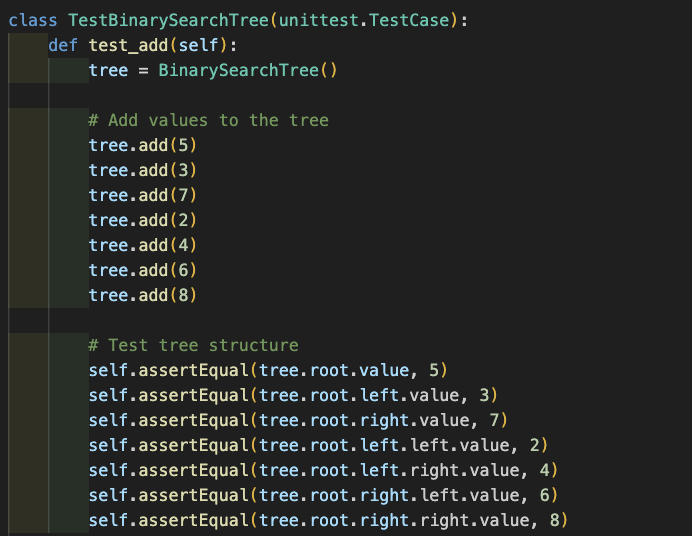
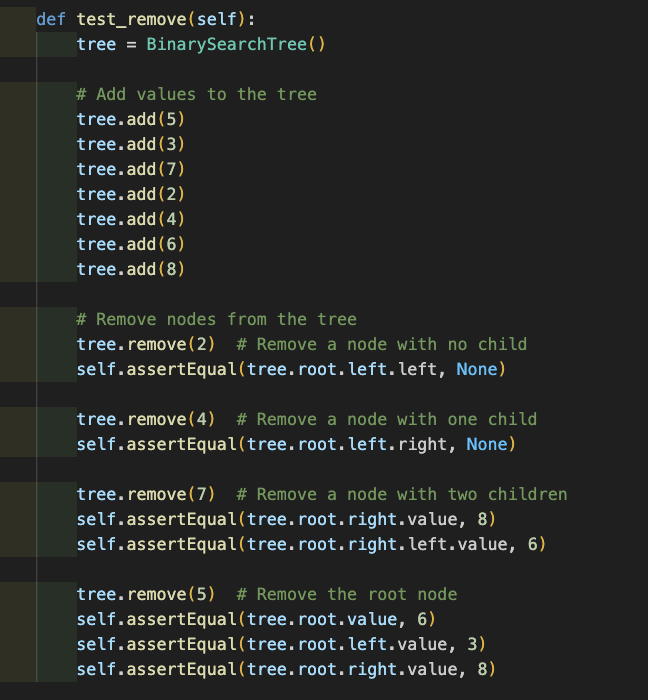
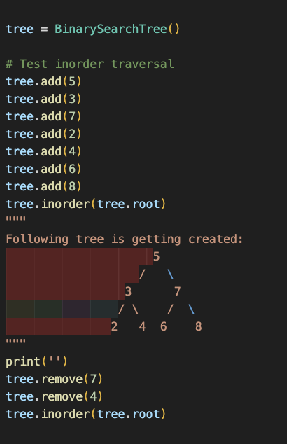
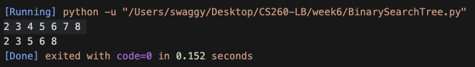
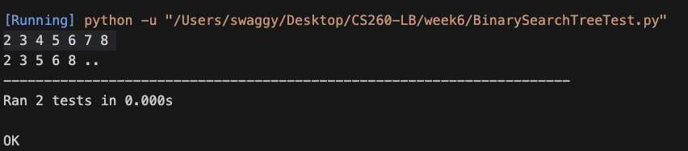

<h1>Design a Binary Search Tree</h1>
<h2>Functions used in Binary Search Tree Data Structure</h2>
<ol>
<h3>Add(value):</h3>
When adding a new value, it traverses the tree based on the comparison of values and adds the new node in the appropriate location.
<ol>
  <li>
    <strong>Initialization:</strong>
    
Create a new node with the given value, representing the node to be added.

  </li>
  
  <li>
    <strong>Root Check:</strong>
    
Check if the root of the tree is empty. If it is, assign the new node as the root and return, as there is no need for further traversal.

  </li>
  
  <li>
    <strong>Traversal and Insertion:</strong>
    
Initialize a current node to the root. Traverse the tree based on the comparison of the value to be added with the current node's value.

    <ul>
      <li>If the value is less than or equal to the current node's value, traverse the left side of the subtree.</li>
      <li>If the value is greater, traverse the right side.</li>
      <li>If a child node exists on the chosen side, update the current node to be the child node and continue traversal.</li>
      <li>If no child node exists on the chosen side, add the new node as the child node and break out of the loop.</li>
    </ul>
  </li>
</ol>

<h3>Remove(value):</h3>
When removing a value, it finds the node, handles different cases (no child, one child, two children), and maintains the ordering property of the Binary Search Tree.
<ol>
  <li>
    <strong>Initialize Helper Method</strong>
    
The use of the helper method allows tracking of the root node during the removal process to maintain the order of the Binary Search Tree.

  </li>
  
  <li>
    <strong>Handling Empty Tree:</strong>
    
Inside the helper method, we'll check if the tree is empty. If it is, the method returns the empty tree.

  </li>
  
  <li>
    <strong>Traversal and Decision:</strong>
    
The method then compares the value to be removed with the value of the current root node to decide which side of the subtree to traverse.

    <ul>
      <li>If the remove value is less than the root node's value, it traverses the left side.</li>
      <li>If the remove value is greater than the root node's value, it traverses the right side.</li>
    </ul>
  </li>
  
  <li>
    <strong>Recursive Removal:</strong>
    
The traversal continues recursively until the node to be removed is found.

    <ul>
      <li>If the node has no child or only one child, it is removed by updating the parent's reference to skip the node.</li>
      <li>If the node has two children, it finds the inorder successor, removes it from the right subtree, and replaces the value of the current root with the inorder successor.</li>
    </ul>
  </li>
  
  <li>
    <strong>Return Updated Root:</strong>
    
The method returns the updated root of the subtree after the removal, ensuring that the changes are reflected for the state of the Binary Search Tree.

  </li>
</ol>

<h3>In Order Traversal</h3>
Prints the values of the nodes in ascending order
<strong>Traversal Process:</strong>

Starting from the root node, the method follows the in-order traversal process recursively:

<ul>
  <li>If the current node has a left child, recursively traverse the left subtree.</li>
  <li>Print the value of the current node.</li>
  <li>If the current node has a right child, recursively traverse the right subtree.</li>
  <li>The recursive traversal stops when it reaches a subtree with no left or right child.</li>
  <li>Values are printed in ascending order as they are visited during the in-order traversal.</li>
</ul>

<h3>Find Minimum Value</h3>
Finds the minimum value in a subtree.
<strong>Traversal Process:</strong>

Starting from the input node, the method follows the process to find the minimum value:

<ul>
  <li>Initialize the current node to the input node.</li>
  <li>While the current node has a left child, continue traversing the left subtree.</li>
  <li>The minimum value is the value of the last node reached without a left child.</li>
  <li>The traversal stops when a subtree with no left child is reached.</li>
  <li>Return the value of the node identified as having the minimum value in the subtree.</li>
</ul>

<h2>Values used in Binary Search Tree</h2>
<ol>
<li>value: Represents the value of the node.</li>
<li>left: Represents the left child node (with a value less than the current node)</li>
<li>right: Represents the right child node (with a value greater than the current node)</li>
<li>root: Represents the root node of the tree</li>
</ol>

<h2>Testing:</h2>
Test Add Function
<ol>
<li>Add values 5,3,7,2,4,6,8 to the tree</li>
<li>Verify the tree structure</li>
</ol>

Test Remove Function

<ol>
<li>Remove a node with no child.</li>
<li>Remove a node with one child.</li>
<li>Remove a node with two children.</li>
<li>Remove the root node.</li>
</ol>

Test In Order Traversal

<ol>
<li>Add values 5,3,7,2,4,6,8 to the tree</li>
<li>Perform in-order traversal and ensure the output is in ascending order.</li>
</ol>

<h1>Binary Search Tree Time Complexity</h1>
<ol>
<h2>Insertion(add)</h2>
<li>Best Case: O(log N) - The average case for insertion is logarithmic, as each comparison reduces the search space by half.</li>
<li>Worst Case: O(N) - In the worst case, insertion can take linear time, as it involves traversing the height of the tree.</li>
</ol>

<ol>
<h2>Search</h2>
<li>Best Case: O(log N) - The best case for search is logarithmic, as each comparison reduces the search space by half.</li>
<li>Worst Case: O(N) - In the worst case, search can take linear time, as it involves traversing the height of the tree.</li>
</ol>

<h1>Unordered Binary Tree< Time Complexity/h1>
<ol>
<h2>Insertion(add)</h2>
<li>Best Case: O(1) - In the best case, insertion is constant time when adding a node without any conflicts.</li>
<li>Worse Case: O(N) - In the worse case, we have to traverse all elements. Therefore, insertion in binary tree has worst case complexity of O(N)</li>
</ol>
<ol>
<h2>Search</h2>
<li>Best Case: O(1) - In the best case, if the target node is the root node, the search is constant time.</li>
<li>Worst Case: O(N) - In the worst case, we may need to traverse all elements to find the target node, resulting in linear time complexity.</li>
</ol>

<h1>Testing Screen shots</h1>

